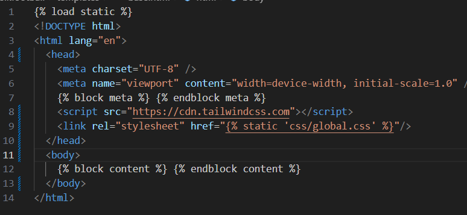
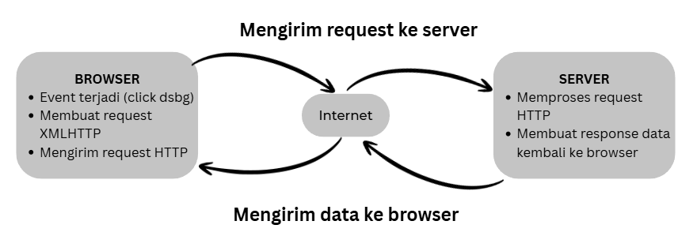

## Tugas 2:
1. Jelaskan bagaimana cara kamu mengimplementasikan checklist di atas secara step-by-step (bukan hanya sekadar mengikuti tutorial).
	Jawab: 
    a) Membuat proyek django baru 
        - Melakukan install django lalu dengan penggunakan command “python -m venv env” lalu menjalankan “env\Scripts\activate”
        - Menyiapkan dependencies
        - Melakukan konfigurasi environment variables dan proyek
        - Menyalakan server serta mematikan server jika diperlukan
    b) Mempersiapkan aplikasi dan konfigurasi model dan view
        - Membuat aplikasi “main” dalam direktori
        - Menambahkan aplikasi pada proyek
        - Menggunakan template yang telah disediakan
        - Memodifikasi variabe templatel yang sesuai dengan tujuan membuat program
    c) Menghubungkan view dan template
        - Mengkonfigurasi URL “main” dan proyek
        - Jalankan django dengan “python manage.py runserver”

2. Buatlah bagan yang berisi request client ke web aplikasi berbasis Django beserta responnya dan jelaskan pada bagan tersebut kaitan antara urls.py, views.py, models.py, dan berkas html.
Jawab: 

Klien > server > django > views > template dan model
klien - views melalui request, template melalui input, model melalui write data

Template dan model > views > django > serve > klien
Template melalui display, model melalui data ,
Views - django melalui URL
Django- klien melalui web page

3. Jelaskan peran settings.py dalam proyek Django!
Jawab: File ini berfungsi untuk melakukan konfigurasi pada proyek django. Konfigurasi yang digunakan diantaranya adalah database, template, dan lain-lain.

4. Bagaimana cara kerja migrasi database di Django?
Jawab: Migrasi di django bekerja dengan cara memberi perintah bahwa adanya perubahan di file yang ada di database melalui command “python manage.py makemigrations”. Setelah itu D=django akan melakukan perubahan dari file migration berdasarkan command sebelumnya menggunakan command “python manage.py migrate”

5. Menurut Anda, dari semua framework yang ada, mengapa framework Django dijadikan permulaan pembelajaran pengembangan perangkat lunak?
Jawab: Menurut saya, django lebih mudah dipahami karena menggunakan basic utama python. Hal ini membuat pemula setidaknya memahami lebih baik program ketimbang bahasa lain yang memiliki basis utama java. Karena saya sendiri pernah mencuri start untuk mencoba print di java namun walaupun sudah persis sama dengan yang diajarkan youtube tapi kode tersebut tidak bisa dijalankan.

6. Apakah ada feedback untuk asisten dosen tutorial 1 yang telah kamu kerjakan sebelumnya?
Jawab: Sejauh ini asdos sudah sangat dapat membantu saya dalam menyelesaikan masalah yang coba saya tanyakan.

## Tugas 3:

1. Jelaskan mengapa kita memerlukan data delivery dalam pengimplementasian sebuah platform?

Data delivery dibutuhkan untuk membuat flow pengiriman informasi antar komponen aplikasi dapat berjalan dengan baik. Hal ini mencakup pengiriman yang konsisten dan aman untuk mencegah kesalahan pengiriman data. Tanpa data delivery, hasil komunikasi antar aplikasi bisa menjadi sulit diatur ataupun rentan rusak.

2. Menurutmu, mana yang lebih baik antara XML dan JSON? Mengapa JSON lebih populer dibandingkan XML?

JSON memiliki sintaks yang jauh lebih sederhana dan juga lebih fleksibel dalam menggunakan bahasa pemrograman javascript ketimbang XML. Tak hanya itu, JSON menggunakan ukuran file yang lebih kecil sehingga mempermudah transmisi data. Kekurangan JSON sendiri adalah keamanannya yang lebih rentan untuk diserang seperti virus. JSON juga hanya memiliki dokumentasi skema yang terbatas sehingga kurang fleksibel .

XML mendukung lebih banyak tipe data ketimbang JSON, contohnya seperti tanggal yang mungkin diperlukan untuk jenis web tertentu. Struktur data yang dibuat dapat lebih mudah dibaca ketimbang JSON dan juga menggunakan bahasa pemrograman yang dapat diimplementasikan ke bahasa pemrograman lainnya. Berbeda dengan JSON, XML menggunakan sintaks yang lebih rumit dan ukuran data yang lebih besar.

Menurut saya JSON lebih populer dikarenakan kemudahannya dalam penggunaan secara cepat. Dikarenakan semakin besar pengkodean maka efisiensi akan menjadi sangat penting.

3. Jelaskan fungsi dari method is_valid() pada form Django dan mengapa kita membutuhkan method tersebut?

Seperti namanya, fungsi method ini melakukan validasi yang dikirimkan pengguna. Jika data yang dikirimkan valid maka akan disimpan dan jika tidak valid maka akan langsung dihapus

4. Mengapa kita membutuhkan csrf_token saat membuat form di Django? Apa yang dapat terjadi jika kita tidak menambahkan csrf_token pada form Django? Bagaimana hal tersebut dapat dimanfaatkan oleh penyerang?

Fungsi utama csrf adalah melindungi aplikasi dari serangan situs tertentu yang menyamar contohnya pada website download online. Beberapa hal yang dapat terjadi ketika tidak menambahkan CSRF token adalah kemudahan jebolnya data karena siapapun dapat melakukan request ke POST tanpa melalui form asli. Hal tersebut dimanfaatkan oleh penyerang melalui pembuatan halaman palsu yang diakses oleh pengguna, kemudian dapat mengubah password email korban, menghapus akun, transaksi keuangan, dan lain sebagainya.

5.  Jelaskan bagaimana cara kamu mengimplementasikan checklist di atas secara step-by-step (bukan hanya sekadar mengikuti tutorial).

Mempersiapkan dirketori baru untuk membuat file html baru berupa create_product dan product_detail. Selanjutnya menambahkan fungsi berupa create_product dan show_product. Fungsi lainnya berkaitan dengan XML dan juga JSON. selanjutnya melakukan routing melalui url dan mengaitkan fungsi tersebut agar bisa digunakan di main. Membuat tombol add untuk menambahkan produk yang ingin dijual. Lalu membuat direktori form.py untuk berbagai kategori yang ingin di show seperti harga. Dari model tersebut dibuat bagian “more” agar detail produk dapat lebih terlihat.

6.  Apakah ada feedback untuk asisten dosen tutorial 2 yang telah kamu kerjakan sebelumnya?
Jawab: Sejauh ini asdos sudah sangat dapat membantu saya dalam menyelesaikan masalah yang coba saya tanyakan.

link foto postman: https://docs.google.com/document/d/1_5-CjRzpEVRuGpWug-JO8lpAHbHNIloiEexLFajqEs8/edit?usp=sharing

## Tugas 4:
1. Apa itu Django AuthenticationForm? Jelaskan juga kelebihan dan kekurangannya.

AuthenticationForm adalah subclass dari Django yang memiliki fokus di login pengguna dan melakukan validasi terhadap input username dan password dari pengguna yang valid. 
Kelebihan: 
Terintegrasi dengan Django
AuthenticationForm Django memang compatible dengan Django karena merupakan bagian dari Django itu sendiri, sehingga akses dan semua fitur dapat didukung secara penuh
Validasi built in
Menangani berbagai proses validasi seperti pengguna aktif,proteksi terhadap timging attacks, dan mencegah login pengguna yang sudah dinonaktifkan
Fleksibel 
AuthenticationForm Django dapat mendukung berbagai authentication backend. Tak hanya itu subclass ini juga dapat diextend dan dikustomisasi sesuai kebutuhan.
Kelebihan: 
Fungsi yang terbatas
AuthenticationForm hanya bisa menangani username dan password authentication dan tidak mendukung multi factor authentication
Tidak mendukung Modern Auth Patterns
AuthenticationForm tidak mendukung passwordless authentication dan tidak mendukung social authentication secara langsung
Security terbatas 
Tidak ada captcha dalam pencegahan brute force password dan username.

2. Apa perbedaan antara autentikasi dan otorisasi? Bagaiamana Django mengimplementasikan kedua konsep tersebut?
Autentikasi adalah proses melakukan verifikasi pengguna. Autentikasi menggunakan alur berupa login user, verifikasi kredensial Django, kemudian membuat sesi. Contohnya adalah ketika melakukan login pada sebuah aplikasi

Otorisasi adalah proses yang melimit apa yang boleh dilakukan user. Implementasinya adalah user melakukan akses resource yang kemudian dicek oleh permission Django, lalu memproses jika akses tersebut ditolak atau diizinkan. Contohnya adalah role admin pada Discord

3. Apa saja kelebihan dan kekurangan session dan cookies dalam konteks menyimpan state di aplikasi web?

Session adalah data yang disimpan di server dimana user mempunyai cookie untuk dapat mengaksesnya. Kelebihan sesson sendiri adalah adanya keamanan data yang dapat disimpan oleh server. Tak hanya itu, sessions dapat menyimpan banyak data dikarenakan kapasitas yang yang besar. Kapasitas besar tersebut juga didukung dengan expire otomatis yang dapat diatur pada waktu tertentu. Kekurangan dari sessions adalah jika sebuah aplikasi menggunakan banyak server, maka sessuin perlu bisa diakses dari server manapun sehingga butuh setup yang rumit. Hal ini juga merujuk pada keperluan server yang lebih kuat untuk menampung data user.

Cookies adalah file kecil yang disimpan di browser user sebagai pengenal dan akses untuk mengakses website. Kelebihan cookies sendiri adalah filenya akan tetap ada meskipun browser ditutup. Selain itu cookies daat langsung dibuat dan dibaca oleh browser. Kekurangan cookies sendiri adalah data kecil yang tersimpan sangat kecil yakni 4 kb, selain itu banyak privacy issues yang tidak disukai user.

4. Apakah penggunaan cookies aman secara default dalam pengembangan web, atau apakah ada risiko potensial yang harus diwaspadai? Bagaimana Django menangani hal tersebut?

Pada dasarnya cookies tidak aman untuk digunakan jika tidak dikonfigurasi dengan benar. Risiko utama yang harus diwaspadai diantaranya adalah
Cross-Site Request Forgery (CSRF) Penyerang bisa membuat website tak dikenal yang otomatis kirim request ke website target menggunakan cookies korban. Seperti seseorang yang memakai kartu identitas kamu untuk masuk ke tempat yang seharusnya hanya kamu yang bisa akses.
Man in the middle attacks Jika cookies dikirim melalui koneksi HTTP biasa (tidak terenkripsi), penyerang di jaringan yang sama bisa "menyadap" dan mencuri cookies tersebut.
Session Hijacking Jika session cookie dicuri, penyerang bisa "menyamar" sebagai pengguna tersebut tanpa perlu tahu username/password.
Tampering/Manipulation Pengguna bisa mengubah nilai cookies di browser mereka, yang bisa menyebabkan masalah jika aplikasi terlalu percaya dengan data cookies.
	Cara Django dapat menanganinya adalah:
Secure Flag Dalam production, Django bisa dikonfigurasi untuk hanya mengirim cookies melalui HTTPS, sehingga tidak bisa disadap di jaringan
CSRF Protection Django punya sistem CSRF protection built-in yang menggunakan token khusus untuk memverifikasi bahwa request benar-benar datang dari pengguna yang sah.
 SameSite Protection Django mendukung SameSite attribute yang mencegah browser mengirim cookies dalam cross-site requests, melindungi dari serangan CSRF.

5. Jelaskan bagaimana cara kamu mengimplementasikan checklist di atas secara step-by-step (bukan hanya sekadar mengikuti tutorial).
Membuat fungsi form dan registrasi dengan mengimport UserCreation Form dan message dan menambah fungsi register dalam direktori views yang berisi form, form.is_valid() form.save, message berisi akun sudah terbuat, dan mereturn ke show_main yang berfungsi untuk melakkan validasi isi input form dan menyimpan data. Kemudian menambah direktori register.html agar terdapat interface register account. Setelah tu di import dari main dan memasukkannya ke url

Serupa dengan registrasi, namun dengan menambah AuthenticationForm dan login. Setelahnya menambah fungsi login_user ke dalam views.py yang kemudian digunakan untuk mengautentikasi user. Fungsinya berisi if request.method == 'POST' untuk memeriksa permintaan,login(request, user) untuk melakukan proses login, Blok else: untuk pengguna baru mengakses halaman login. Lalu dimasukkan ke direktori baru login.html lagar terdapat interface login account. Setelah tu di import dari main dan memasukannya ke url

Sedikit berbeda dengan login, logout hanya perlu mengimport logout dan menambah fungsi logout yang isinya request dan mendirect ke main untuk login. Lalu menambah berkas pada main.html dan menambahkan pada url
Selanjutanya menambah import login_required di views dan mengblock bagian show_main dan show_product agar user dapat melakukan login

Agar dapat menggunakan data dari cookies, melaukan import datetime, HttpResponseRedirect dan reverse dan mengubah fungsi login_user untuk menympan cookie baru bernama las_login untuk dapat mengtrack data user. Lalu pada show_main menambah context yang berisi last_login dengan cookie yang telah dibuat. Lalu pada fungsi logout_user di views akan menambah response.delete_cookie(‘last_login’) untuk memberi data terakhir kali login.

Yang terakhir menghubungkan objek pada product dengan user dengan mengimport user dan membuat class baru untuk user sehingga terdapat data untuk masing-masing user. Lalu menambah request user pada fungsi create_product dan juga mengubah fungsi show_main sesuai dengan request user. Setelah itu masukkan pada main.html agar terpisah artikel yang dibuat user dan semua artikel serta menambah author di product_detail berupa author

link screenshot: https://docs.google.com/document/d/1B1ZS-FTU9xC_DUPDGQchrzWW9p0oBRyhViKnlVFII_k/edit?usp=sharing

## Tugas 5: 

1. Jika terdapat beberapa CSS selector untuk suatu elemen HTML, jelaskan urutan prioritas pengambilan CSS selector tersebut!

Inline style → paling kuat karena langsung ditempel di elemen.


ID selector → lebih spesifik daripada class.


Class, atribut, pseudo-class → prioritas menengah.


Elemen & pseudo-elemen → prioritas terakhir
	

2. Mengapa responsive design menjadi konsep yang penting dalam pengembangan aplikasi web? Berikan contoh aplikasi yang sudah dan belum menerapkan responsive design, serta jelaskan mengapa!

	Responsive design penting karena memastikan tampilan aplikasi web tetap nyaman digunakan di berbagai perangkat (HP, tablet, laptop, monitor besar) tanpa harus membuat versi berbeda. Hal ini meningkatkan user experience, aksesibilitas, dan efisiensi pengembangan.

Contoh yang sudah menerapkan responsive design:

 layout video dan sidebar di YouTube menyesuaikan ukuran layar; di HP fokus ke video, di desktop muncul rekomendasi di samping.

Contoh yang belum menerapkan responsive design:

Beberapa website pemerintah lama → ketika dibuka di HP, teks terlalu kecil, tombol sulit ditekan, dan harus zoom in/out manual.

Perbedaan utama: website responsif terasa natural dipakai di layar kecil maupun besar, sedangkan yang tidak responsif cenderung sulit dibaca/diakses di perangkat selain PC.


3. Jelaskan perbedaan antara margin, border, dan padding, serta cara untuk mengimplementasikan ketiga hal tersebut!

	Padding: mengosongkan area di sekitar konten (transparan)

.form-style form input, form textarea, form select {
    width: 100%;
    padding: 0.5rem;
    border: 2px solid #bcbcbc;
    border-radius: 0.375rem;
}

Border: garis tepian yang membungkus konten dan padding-nya

.form-style input[type="checkbox"] {
    width: 1.25rem;
    height: 1.25rem;
    padding: 0;
    border: 2px solid #d1d5db;
    border-radius: 0.375rem;
    background-color: white;
    cursor: pointer;
    position: relative;
    appearance: none;
    -webkit-appearance: none;
    -moz-appearance: none;
}

Margin: mengosongkan area di sekitar border (transparan)
#header {
  background-color: #a3b90e;
  margin-top: 0;
  padding: 20px 20px 20px 40px;
}

4. Jelaskan konsep flex box dan grid layout beserta kegunaannya!

Flexbox

Konsep: Mengatur elemen dalam satu dimensi (baris atau kolom).

Kegunaan: Cocok untuk layout sederhana seperti navbar, tombol berjajar, card yang rata tengah, atau menyusun elemen dalam satu baris/kolom fleksibel.

Grid Layout

Konsep: Mengatur elemen dalam dua dimensi (baris dan kolom sekaligus).

Kegunaan: Cocok untuk layout kompleks seperti halaman majalah, dashboard, galeri foto, atau struktur dengan banyak kolom dan baris.


Flexbox = solusi cepat untuk baris/kolom.

Grid = solusi lebih terstruktur untuk tata letak halaman penuh.

5. Jelaskan bagaimana cara kamu mengimplementasikan checklist di atas secara step-by-step (bukan hanya sekadar mengikuti tutorial)!

- Menginstall tailwind dengan mengganti base.html menjadi seperti ini 

- menambah fitur edit:
    - membuat fungsi baru pada direktori views.py dengan isi berupa
    ```
    def edit_product(request, id):
    product = get_object_or_404(Product, pk=id)
    form = ProductForm(request.POST or None, instance=product)
    if form.is_valid() and request.method == 'POST':
        form.save()
        return redirect('main:show_main')

    context = {
        'form': form
    }
    ```

    - kemudian membuat direktori baru dengan nama edit_product.html di main/templates dengan dengan isi: 
    ```
    
    

    
    <title>Edit Product - Fisik Football </title>
    

    
    <div class="bg-gray-50 w-full min-h-screen">
    <div class="max-w-3xl mx-auto px-4 sm:px-6 lg:px-8 py-8">
        
        <!-- Back Navigation -->
        <div class="mb-6">
        <a href="" class="text-gray-600 hover:text-gray-900 font-medium transition-colors">
            ← Back to Product
        </a>
        </div>
        
        <!-- Form -->
        <div class="bg-white rounded-lg border border-gray-200 p-6 sm:p-8 form-style">
        <div class="mb-8">
            <h1 class="text-2xl font-bold text-gray-900 mb-2">Edit Product</h1>
            <p class="text-gray-600">Update your football gears and accessories</p>
        </div>
        
        <form method="POST" class="space-y-6">
            
            
            <div>
                <label for="{{ field.id_for_label }}" class="block text-sm font-medium text-gray-700 mb-2">
                {{ field.label }}
                </label>
                <div class="w-full">
                {{ field }}
                </div>
                
                <p class="mt-1 text-sm text-gray-500">{{ field.help_text }}</p>
                
                
                <p class="mt-1 text-sm text-red-600">{{ error }}</p>
                
            </div>
            
            
            <div class="flex flex-col sm:flex-row gap-4 pt-6 border-t border-gray-200">
            <a href="" class="order-2 sm:order-1 px-6 py-3 border border-gray-300 text-gray-700 rounded-md font-medium hover:bg-gray-50 transition-colors text-center">
                Cancel
            </a>
            <button type="submit" class="order-1 sm:order-2 flex-1 bg-green-600 text-white px-6 py-3 rounded-md font-medium hover:bg-green-700 transition-colors">
                Update Product
            </button>
            </div>
        </form>
        </div>
    </div>
    </div>
    
    ```
    - menambah import pada urls.py berupa edit_product dan menambah potongan kode ini pada urlpatterns
    ```
    path('product/<uuid:id>/edit', edit_product, name='edit_product'),
    ```

- menambah fitur delete:
    - membuat fungsi baru di views.py
    ```
    def delete_product(request, id):
        product = get_object_or_404(News, pk=id)
        product.delete()
        return HttpResponseRedirect(reverse('main:show_main'))
    ```

    - membuat import delete_product di urls dan menambah path pada urlpattern
    ```
    path('product/<uuid:id>/delete', delete_product, name='delete_product'),
    ```

- menambah navigation bar
    - membuat berkasnavbar.html di folder templates dengan isi

    ```
    <nav class="fixed top-0 left-0 w-full bg-gray-800 border-b border-gray-700 shadow-sm z-50">
    <div class="max-w-7xl mx-auto px-6 lg:px-8">
        <div class="flex items-center justify-between h-16">
        <!-- Logo / Brand -->
        <div class="flex items-center">
            <h1 class="text-xl font-semibold">
            <span class="text-green-500">Fisik</span>
            <span class="text-white">Football</span>
            </h1>
        </div>
        
        <!-- Desktop Navigation -->
        <div class="hidden md:flex items-center space-x-8">
            <a href="/" class="text-gray-300 hover:text-white font-medium transition-colors">
            Home
            </a>
            <a href="" class="text-gray-300 hover:text-white font-medium transition-colors">
            Create Product
            </a>
        </div>
        
        <!-- Desktop User Section -->
        <div class="hidden md:flex items-center space-x-6">
            
            <div class="text-right">
                <div class="text-sm font-medium text-white">{{ name|default:user.username }}</div>
                <div class="text-xs text-gray-400">{{ npm|default:"Student" }} - {{ class|default:"Class" }}</div>
            </div>
            <a href="" class="text-red-400 hover:text-red-500 font-medium transition-colors">
                Logout
            </a>
            
            <a href="" class="text-gray-300 hover:text-white font-medium transition-colors">
                Login
            </a>
            <a href="" class="bg-green-600 hover:bg-green-700 text-white px-4 py-2 rounded font-medium transition-colors">
                Register
            </a>
            
        </div>
        
        <!-- Mobile Menu Button -->
        <div class="md:hidden flex items-center">
            <button class="mobile-menu-button p-2 text-gray-300 hover:text-white transition-colors">
            <span class="sr-only">Open menu</span>
            <div class="w-6 h-6 flex flex-col justify-center items-center">
                <span class="bg-current block transition-all duration-300 ease-out h-0.5 w-6 rounded-sm"></span>
                <span class="bg-current block transition-all duration-300 ease-out h-0.5 w-6 rounded-sm my-0.5"></span>
                <span class="bg-current block transition-all duration-300 ease-out h-0.5 w-6 rounded-sm"></span>
            </div>
            </button>
        </div>
        </div>
    </div>

    <!-- Mobile Menu -->
    <div class="mobile-menu hidden md:hidden bg-gray-800 border-t border-gray-700">
        <div class="px-6 py-4 space-y-4">
        <!-- Mobile Navigation Links -->
        <div class="space-y-1">
            <a href="/" class="block text-gray-300 hover:text-white font-medium py-3 transition-colors">
            Home
            </a>
            <a href="" class="block text-gray-300 hover:text-white font-medium py-3 transition-colors">
            Create product
            </a>
        </div>
        
        <!-- Mobile User Section -->
        <div class="border-t border-gray-700 pt-4">
            
            <div class="mb-4">
                <div class="font-medium text-white">{{ name|default:user.username }}</div>
                <div class="text-sm text-gray-400">{{ npm|default:"Student" }} - {{ class|default:"Class" }}</div>
            </div>
            <a href="" class="block text-red-400 hover:text-red-500 font-medium py-3 transition-colors">
                Logout
            </a>
            
            <div class="space-y-3">
                <a href="" class="block text-gray-300 hover:text-white font-medium py-3 transition-colors">
                Login
                </a>
                <a href="" class="block bg-green-600 hover:bg-green-700 text-white font-medium py-3 px-4 rounded text-center transition-colors">
                Register
                </a>
            </div>
            
        </div>
        </div>
    </div>

    <script>
        const btn = document.querySelector("button.mobile-menu-button");
        const menu = document.querySelector(".mobile-menu");
        btn.addEventListener("click", () => {
        menu.classList.toggle("hidden");
        });
    </script>
    </nav>
    ```
    - menambah include di main html di paling atas berupa
    ```
    
    ```

- melakukan styling aplikasi dengan tailwind dan css
    - membuka settings.py  dan mengganti STATIC_URL dengan
    ```
    STATIC_URL = '/static/'
    if DEBUG:
        STATICFILES_DIRS = [
            BASE_DIR / 'static' # merujuk ke /static root project pada mode development
        ]
    else:
        STATIC_ROOT = BASE_DIR / 'static' # merujuk ke /static root project pada mode production
    ```

    - membuat direktori baru dengan nama global.css di dalam folderstatic dan folder css dan menghubungkannya ke base.html

    ```
    .form-style form input, form textarea, form select {
        width: 100%;
        padding: 0.5rem;
        border: 2px solid #4b5563; /* abu-abu gelap */
        border-radius: 0.375rem;
        background-color: #2d2d2d; /* abu-abu tua */
        color: #e5e7eb; /* teks abu-abu terang */
    }

    body {
        background-color: #1e293b; /* biru keabu-abuan gelap */
        color: #e5e7eb; /* teks default */
    }

    .form-style form input:focus, form textarea:focus, form select:focus {
        outline: none;
        border-color: #3b82f6; /* biru terang sebagai highlight */
        box-shadow: 0 0 0 3px rgba(59, 130, 246, 0.5);
    }

    .form-style input[type="checkbox"]:checked {
        background-color: #3b82f6; /* biru terang */
        border-color: #3b82f6;
    }
    ```

    - mengubah login.html menjadi seperti ini
    ```
    

    
    <title>Login - Fisik Football </title>
    

    
    <div class="bg-gray-50 w-full min-h-screen flex items-center justify-center p-8">
    <div class="max-w-md w-full">
        <div class="bg-white rounded-lg border border-gray-200 p-6 sm:p-8 form-style">
        <div class="text-center mb-8">
            <h1 class="text-2xl font-bold text-gray-900 mb-2">Sign In</h1>
            <p class="text-gray-600">Welcome back to Fisik Football</p>
        </div>

        <!-- Form Errors Display -->
        
            <div class="mb-6">
            
                <div class="px-4 py-3 rounded-md text-sm border bg-red-50 border-red-200 text-red-700">
                {{ error }}
                </div>
            
            </div>
        

        
            <div class="mb-6">
            
                
                
                    <div class="px-4 py-3 rounded-md text-sm border bg-red-50 border-red-200 text-red-700 mb-2">
                    <strong>{{ field|title }}:</strong> {{ error }}
                    </div>
                
                
            
            </div>
        

        <form method="POST" action="" class="space-y-6">
            
            
            <div>
            <label for="username" class="block text-sm font-medium text-gray-700 mb-2">Username</label>
            <input 
                id="username" 
                name="username" 
                type="text" 
                required 
                class="w-full px-4 py-3 border border-gray-300 rounded-md focus:outline-none focus:border-green-500 transition-colors" 
                placeholder="Enter your username">
            </div>

            <div>
            <label for="password" class="block text-sm font-medium text-gray-700 mb-2">Password</label>
            <input 
                id="password" 
                name="password" 
                type="password" 
                required 
                class="w-full px-4 py-3 border border-gray-300 rounded-md focus:outline-none focus:border-green-500 transition-colors" 
                placeholder="Enter your password">
            </div>

            <button 
            type="submit" 
            class="w-full bg-green-600 text-white font-medium py-3 px-4 rounded-md hover:bg-green-700 transition-colors">
            Sign In
            </button>
        </form>

        <!-- Messages Display -->
        
            <div class="mt-6">
            
                <div 
                class="
                    px-4 py-3 rounded-md text-sm border
                    
                    bg-green-50 border-green-200 text-green-700
                    
                    bg-red-50 border-red-200 text-red-700
                    
                    bg-gray-50 border-gray-200 text-gray-700
                    
                ">
                {{ message }}
                </div>
            
            </div>
        

        <div class="mt-6 text-center pt-6 border-t border-gray-200">
            <p class="text-gray-500 text-sm">
            Don't have an account? 
            <a href="" class="text-green-600 hover:text-green-700 font-medium">
                Register Now
            </a>
            </p>
        </div>
        </div>
    </div>
    </div>
    
    ```
    - demikian untuk register.html
    ```
    

    
    <title>Register - Fisik Footballl </title>
    

    
    <div class="form-style">
    <div class="min-h-screen bg-gray-50 flex items-center justify-center p-8">
        <div class="max-w-md w-full relative z-10">
        <div class="bg-white border border-gray-200 rounded-lg p-8 shadow-sm">
        <div class="text-center mb-8">
            <h2 class="text-2xl font-semibold text-gray-900 mb-2">Join Us</h2>
            <p class="text-gray-500">Create your Fisik Football account</p>
        </div>

        <!-- Form Errors Display -->
        
            <div class="mb-6">
            
                <div class="px-4 py-3 rounded text-sm border bg-red-50 border-red-200 text-red-700">
                {{ error }}
                </div>
            
            </div>
        

        
            <div class="mb-6">
            
                
                
                    <div class="px-4 py-3 rounded text-sm border bg-red-50 border-red-200 text-red-700 mb-2">
                    <strong>{{ field|title }}:</strong> {{ error }}
                    </div>
                
                
            
            </div>
        

        <form method="POST" action="" class="space-y-5">
            
            
            <div>
            <label for="username" class="block text-sm font-medium text-gray-700 mb-2">Username</label>
            <input 
                id="username" 
                name="username" 
                type="text" 
                required 
                class="w-full px-4 py-3 border border-gray-300 rounded focus:outline-none focus:border-green-500 transition duration-200" 
                placeholder="Choose a username">
            </div>

            <div>
            <label for="password1" class="block text-sm font-medium text-gray-700 mb-2">Password</label>
            <input 
                id="password1" 
                name="password1" 
                type="password" 
                required 
                class="w-full px-4 py-3 border border-gray-300 rounded focus:outline-none focus:border-green-500 transition duration-200" 
                placeholder="Create a password">
            </div>

            <div>
            <label for="password2" class="block text-sm font-medium text-gray-700 mb-2">Confirm Password</label>
            <input 
                id="password2" 
                name="password2" 
                type="password" 
                required 
                class="w-full px-4 py-3 border border-gray-300 rounded focus:outline-none focus:border-green-500 transition duration-200" 
                placeholder="Confirm your password">
            </div>

            <button 
            type="submit" 
            class="w-full bg-green-600 text-white font-medium py-3 px-4 rounded hover:bg-green-700 focus:outline-none focus:ring-2 focus:ring-green-500 focus:ring-offset-2 transition duration-200">
            Create Account
            </button>
        </form>

        <!-- Messages Display -->
        
            <div class="mt-6">
            
                <div 
                class="
                    px-4 py-3 rounded text-sm border
                    
                    bg-green-50 border-green-200 text-green-700
                    
                    bg-red-50 border-red-200 text-red-700
                    
                    bg-gray-50 border-gray-200 text-gray-700
                    
                ">
                {{ message }}
                </div>
            
            </div>
        

        <div class="mt-6 text-center">
            <p class="text-gray-500 text-sm">
            Already have an account? 
            <a href="" class="text-green-600 hover:text-green-700 font-medium">
                Sign In
            </a>
            </p>
        </div>
        </div>
        </div>
    </div>
    </div>
    
    ```

    - memodifikasi card_product.html 
    ```
    
    <article class="bg-white dark:bg-gray-900 rounded-lg border border-gray-200 dark:border-gray-700 hover:shadow-lg transition-shadow duration-300 overflow-hidden">
    <!-- Thumbnail -->
    <div class="aspect-[16/9] relative overflow-hidden">
        
        
        
        <div class="w-full h-full bg-gray-200"></div>
        

        <!-- Category Badge -->
        <div class="absolute top-3 left-3">
        <span class="inline-flex items-center px-2.5 py-0.5 rounded-md text-xs font-medium bg-green-600 text-white">
            {{ product.get_category_display }}
        </span>
        </div>

        <!-- Status Badges -->
        <div class="absolute top-3 right-3 flex space-x-2">
        
            <span class="inline-flex items-center px-2 py-1 rounded text-xs font-medium bg-yellow-100 text-yellow-800">
            Featured
            </span>
        
        
            <span class="inline-flex items-center px-2 py-1 rounded text-xs font-medium bg-red-100 text-red-800">
            Hot
            </span>
        
        </div>
    </div>

    <!-- Content -->
    <div class="p-5">
        <div class="flex items-center text-sm text-gray-500 mb-3">
        <time datetime="{{ product.created_at|date:'c' }}">
            {{ product.created_at|date:"M j, Y" }}
        </time>
        <span class="mx-2">•</span>
        <span>{{ product.product_views }} views</span>
        </div>

        <h3 class="text-lg font-semibold text-gray-900 dark:text-gray-100 mb-3 line-clamp-2 leading-tight">
        <a href="" class="hover:text-green-600 dark:hover:text-green-400 transition-colors">
            {{ product.name }}
        </a>

        <br>

        <a href="" class="hover:text-green-600 transition-colors">
            {{ product.price }}
        </a>
        </h3>

        <p class="text-gray-600 text-sm leading-relaxed line-clamp-3 mb-4">
        {{ product.content|truncatewords:20 }}
        </p>

        <!-- Action Buttons -->
        
        <div class="flex items-center justify-between pt-4 border-t border-gray-100">
            <a href="" class="text-green-600 hover:text-green-700 font-medium text-sm transition-colors">
            Read more
            </a>
            <div class="flex space-x-2">
            <a href="" class="text-gray-600 hover:text-gray-700 text-sm transition-colors">
                Edit
            </a>
            <a href="" class="text-red-600 hover:text-red-700 text-sm transition-colors">
                Delete
            </a>
            </div>
        </div>
        
        <div class="pt-4 border-t border-gray-100">
            <a href="" class="text-green-600 hover:text-green-700 font-medium text-sm transition-colors">
            Read more →
            </a>
        </div>
        
    </div>
    </article>
    ```
- menambah folder images di direktori css dan menambah file foto berupa no-product.png
- mengupdate main.html sehingga menjadi seperti ini
```




<title>Fisik Football </title>




<div class="bg-gray-50 w-full pt-16 min-h-screen">
  <div class="max-w-7xl mx-auto px-4 sm:px-6 lg:px-8 py-8">

    <!-- Header Section -->
    <div class="mb-8">
      <h1 class="text-3xl font-bold text-gray-900 mb-2">Latest Football Product</h1>
      <p class="text-gray-600">Stay updated with the latest football gears and accessories</p>
    </div>

    <!-- Filter Section -->
    <div class="flex flex-col sm:flex-row sm:items-center sm:justify-between mb-8 bg-white rounded-lg border border-gray-200 p-4">
      <div class="flex space-x-3 mb-4 sm:mb-0">
        <a href="?" class=" bg-green-600 text-whitebg-white text-gray-700 border border-gray-300 px-4 py-2 rounded-md font-medium transition-colors hover:bg-green-600 hover:text-white">
          All Product
        </a>
        <a href="?filter=my" class=" bg-green-600 text-whitebg-white text-gray-700 border border-gray-300 px-4 py-2 rounded-md font-medium transition-colors hover:bg-green-600 hover:text-white">
          My Product
        </a>
      </div>
      
        <div class="text-sm text-gray-500">
          Last login: {{ last_login }}
        </div>
      
    </div>

    <!-- Product Grid -->
    
      <div class="bg-white rounded-lg border border-gray-200 p-12 text-center">
        <div class="w-32 h-32 mx-auto mb-4">
          
        </div>
        <h3 class="text-lg font-medium text-gray-900 mb-2">No product found</h3>
        <p class="text-gray-500 mb-6">Be the first to sell your football product in Fisik Football.</p>
        <a href="" class="inline-flex items-center px-4 py-2 bg-green-600 text-white rounded-md hover:bg-green-700 transition-colors">
          Create Product
        </a>
      </div>
    
      <div class="grid grid-cols-1 md:grid-cols-2 lg:grid-cols-3 gap-6">
        
          
        
      </div>
    
  </div>
</div>


## Tugas 6:
1. Apa perbedaan antara synchronous request dan asynchronous request?
    - synchronous melakukan form submit dengan step berupa:
    mengirim tombol klik -> mengirim request ke django -> django memproses dan mengirim html baru -> halaman melakukan reload
    - asynchronous diartikan mengirim request ke django tanpa reload halaman 
    user melakukan aksi -> javascript mengirim data ke django -> django mengirim ke json -> javascript mengubah dom
2. Bagaimana AJAX bekerja di Django (alur request–response)?

    - user melakukan event contohnya click
    - pembuatan XMLHTTPRequest object oleh javascript
    - XMLHTTPRequest object diteruskan ke server
    - server memproses request
    - server mengembalikan response
    - response dibaca javascript
    - javascript memperbarui data
3. Apa keuntungan menggunakan AJAX dibandingkan render biasa di Django?
    - tidak perlu reload web atau memencet f5 karena hanya memperbarui bagian tertentu
    - membuat user experience lebih nyaman karena tidak ada flash putih saat loading
    - memiliki fitur autocomplete layaknya website modern 
    - lebih responsif dan tiap aksi tidak memerlukan adanya reload
4. Bagaimana cara memastikan keamanan saat menggunakan AJAX untuk fitur Login dan Register di Django?
    - mengaktifkan CSRF protection
    - menambahkan strip_tags 
    1. dengan menambah import:
    ```from django.utils.html import strip_tags```
    2. mengupdate fungsi add_product_entry_ajax dengan csrf
    ```@csrf_exempt
@require_POST
def add_news_entry_ajax(request):
    title = strip_tags(request.POST.get("title")) # strip HTML tags!
    content = strip_tags(request.POST.get("content")) # strip HTML tags!```
    3. mengupdate forms.py dengan menambah kode berikut (sesuai dengan isi dari forms.py)
    ```    def clean_name(self):
        name = self.cleaned_data["name"]
        return strip_tags(name)

    def clean_description(self):
        description = self.cleaned_data["description"]
        return strip_tags(description)```
5. Bagaimana AJAX mempengaruhi pengalaman pengguna (User Experience) pada website?
    - singkatnya ajax membantu membuat website lebih cepat dan tidak banyak load
    - memiliki fitur autocomplete yang memudahkan user
    - tidak ada flash putih saat loading
    - sangat modern dan terasa cepat


